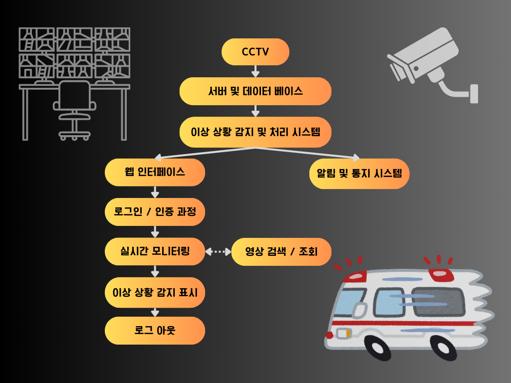

# 스마트 CCTV  
정성원, 박성준  
## 개요  
이 문서는 스마트 CCTV 개발에 대한 기획서입니다. 이 프로그램은 CCTV 영상을 실시간으로 웹 상에서 모니터링하고, 이상 행동을 감지하여 응급 상황에 신속하게 대응할 수 있도록 합니다.  
## 목표  
 - CCTV 영상을 실시간으로 웹 상에서 모니터링할 수 있는 시스템 개발  
 - 인공지능 기술을 활용하여 이상 행동을  감지하는 기능 구현  
 - 이상 상황 발생 시 관리자나 구조대에 실시간으로 알림을 전송하는 기능 구현  
## 주요 기능    
 1. CCTV 영상 실시간 모니터링  
 2. 이상 상황 감지  
 3. 알림 기능  
 4. 과거 CCTV 영상 검색 및 조회  
## 아키텍처 설계  
 - CCTV 카메라 및 영상 수집 시스템  
  1. CCTV 카메라로 영상을 촬영하고 실시간으로 영상을 수집합니다.  
  2. 영상 수집 시스템은 CCTV 카메라로부터 수집된 영상 데이터를 처리하여 서버로 전송합니다.  
 - 서버 및 데이터베이스  
  1. 수집된 영상 데이터는 서버에 저장되며, 데이터베이스에 적절하게 저장됩니다.  
  2. 데이터베이스는 CCTV 영상 데이터뿐만 아니라 감지된 이상 상황 및 관련 정보를 저장합니다.  
 - 이상 상황 감지 및 처리 시스템  
  1. 영상 데이터를 실시간으로 분석하여 이상 행동을 감지하는 알고리즘을 구현합니다.  
  2. 감지된 이상 상황은 관리자나 구조대에 알림을 전송하고 응급 조치를 취할 수 있도록 합니다.  
 - 웹 인터페이스  
  1. 사용자는 웹 인터페이스를 통해 실시간으로 CCTV 영상을 모니터링할 수 있습니다.  
  2. 사용자가 이상 상황을 신속하게 파악할 수 있도록 감지된 이상 상황을 시각적으로 표시합니다.  
  3. 이상 상황 발생 시 발생 원인을 확인하기 위해 영상을 검색하고 조회합니다.  
 - 알림 및 통지 시스템  
  1. 이상 상황이 감지되면 관리자나 구조대에 알림을 전송해야 합니다.  
  2. 푸시 알림: 관리자 도는 구조대의 스마트폰 애플리케이션으로 실시간 알림을 전송하여 빠르고 효율적으로 대응이 가능합니다.  
  3. MQTT: 이상 상황이 감지되면 MQTT 브로커로 메시지를 발행, 관리자에게 알림이 전송되도록 합니다.  
  4. 카카오톡 비즈 메시지 API: 긴급성이나 편의성등 즉각적인 알림 방법으로서 효과적일 수 있습니다. 
  5. 경보음 & 경고등 작동: IoT 기기나 자동화 제어 시스템을 사용, 해당 기기들을 제어가 가능합니다.  
 - 확장성 및 유지보수성  
  1. 추후에 CCTV 카메라의 수가 늘어날 경우 확장 가능해야 합니다.  
     새로운 카메라를 추가할 때 시스템이 자동으로 인식하고 통합할 수 있어야 합니다.  
  2. 시스템의 유지보수를 위해 모듈화된 아키텍처가 필요합니다.  
### 플로우차트  

## 일정 계획  
### * 프로젝트 기간 : 약 12주 (2024-04-17 ~ 2024-07-05)  
 - 목표설정 및 요구사항 분석 (3일):  
  1. 프로젝트 주제 선정 및 목표 설정  
  2. 요구사항 정의 및 문서화  
 - 프로젝트 범위 및 시스템 설계 (1주):  
  1. 프로젝트 범위 설정  
  2. 시스템 설계 : 아키텍쳐 설계 및 기술 스택 결정, 프로토 타입 개발  
 - 개발 및 구현 (8주):  
  1. 개발자 역할 분담 및 수행 (2인)  
  2. 웹 인터페이스 개발 (5주)  
  3. 이상 상황 감지 프로그램 개발 (5주)  
  4. 알림 기능 구현 (3주)  
  5. 영상 검색 및 조회 기능 개발 (3주)  
 - 테스트 및 검증 (2주):  
  1. 시스템 통합 테스트 및 피드백 수렴  
  
### * 역할 분담  
 - 웹 인터페이스 개발 : 박성준  
 - 이상 상황 감지 프로그램 개발 : 정성원  
 - 알림 기능 구현 : 박성준  
 - 영상 검색 및 조회 기능 개발 : 정성원  

## 개발 환경  
 - 웹 개발 환경:  
  1. 프론트엔드 : HTML, CSS, JavaScript  
  2. 백엔드 : Python의 Flask 프레임워크  
 - 알고리즘 개발 환경:  
  1. Python : 딥러닝 라이브러리인 Tensorflow, YOLO 객체 탐지 알고리즘을 사용하여 이상 상황 감지 알고리즘 개발  
  2. OpenCV : 영상처리 및 분석  
 - 알림 기능:  
  1. MQTT  
  2. 카카오톡 비즈 메세지 API  
 - 데이터베이스:  
  1. SQLite  
 - 시스템 구축 및 관리 환경:  
  1. 운영 체제 : Windows  
  2. 웹 서버 : Flask 웹 서버  
  3. MQTT 브로커 : mosquitto  
 - 협업 및 프로젝트 관리 도구:  
  1. GitHub  
 - 개발 도구 및 IDE:  
  1. 웹 : VSC  
  2. 알고리즘 : Spyder, VSC  
  3. MQTT : Arduino IDE  
  4. 데이터베이스 : SQLiteManager  
## 웹 화면 설명  
 - 로그인 페이지 : 사용자 인증을 위한 로그인 화면  
 - 대시보드 페이지 : 실시간 영상 모니터링 및 이상 상황 확인  
 - 영상 검색 및 조회 페이지 : 과거 CCTV 영상 검색 및 조회 기능 제공  
## 참고 자료  
 - AIHub 이상행동 CCTV 영상 : https://aihub.or.kr/aihubdata/data/view.do?currMenu=115&topMenu=100&aihubDataSe=data&dataSetSn=171  
 - OpenCV 공식 문서: https://opencv.org/  
 - Flask 공식 문서: https://flask.palletsprojects.com/  
 - Yolov8 custom dataset trining: https://docs.ultralytics.com/quickstart/#use-ultralytics-with-cli  
 - MQTT Protocol 실전편: https://underflow101.tistory.com/24  
